# Agilent 34401A Remote Control

A Tk desktop application and command-line tool for remotely operating an Agilent/HP 34401A
6½-digit digital multimeter (the Meter) over GPIB or RS-232, with a built-in Simulator for development, demos
and testing. Live readout and chart, every Function, Range, Resolution and Integration Time, triggering and Bursts,
the Meter's Math, saved Presets, CSV recording, and a raw SCPI console.

> This project was developed with the assistance of AI, using Claude Code. See [AI assistance](#ai-assistance).

> Version 0.1.0, alpha. It is not on PyPI yet and has no release: install it from a checkout (see
> [Installation](#installation)).

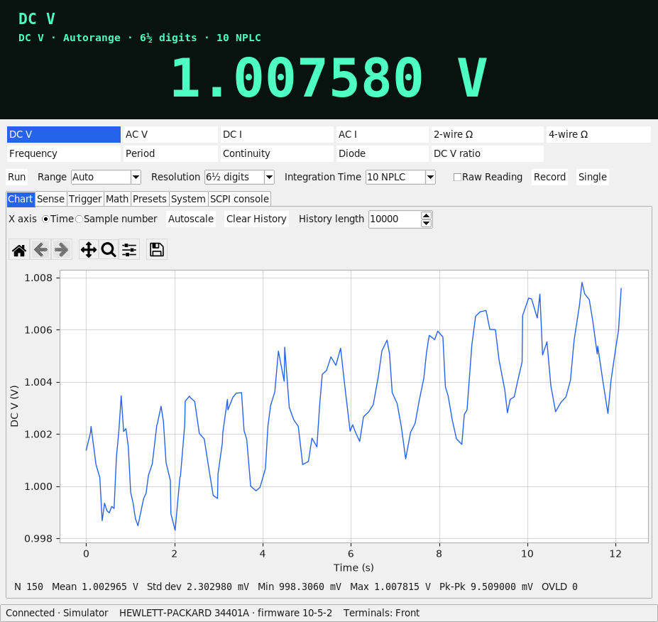

All communication with the Meter happens on a single background Worker thread, so the window stays responsive
during slow Readings, Bursts and Probes; the Tk main thread never touches the Connection.

## Contents

- [Installation](#installation) · [Setup from source](#setup-from-source) · [Windows setup](#windows-setup-keysight-io-libraries-and-the-82357b) · [Linux GPIB](#linux-gpib)
- [First connection checklist](#first-connection-checklist)
- [The window](#the-window): [tabs](#tabs) · [themes and compact mode](#themes-and-compact-mode) · [keyboard shortcuts](#keyboard-shortcuts) · [settings and Presets files](#settings-and-presets-files)
- [Command line](#command-line) · [RS-232](#rs-232) · [Recording and CSV](#recording-and-csv) · [Single and Burst](#single-and-burst) · [Math](#math) · [Presets](#presets)
- [Simulator](#simulator)
- [Development](#development): [code quality](#code-quality) · [screenshots](#screenshots) · [releasing](#releasing) · [freezing](#freezing)
- [AI assistance](#ai-assistance) · [License](#license)

## Installation

Requirements: Python 3.10 or later, and `tkinter`, which `pip` cannot install: it ships with your operating
system's Python. It is bundled with the standard Windows and macOS installers; on Debian/Ubuntu install
`sudo apt install python3-tk`. The package itself needs only matplotlib, pyvisa, pyvisa-py and pyserial, which `pip`
installs for you, so the Simulator and RS-232 work without any vendor software. Only GPIB through the Keysight 82357B
on Windows needs the Keysight IO Libraries (below).

The project is not on PyPI yet, so `pip install agilent34401a` does not work yet. Install from a checkout of this
repository (next section), or, once a release exists, from the wheel attached to it:

```bash
pip install agilent34401a-0.1.0-py3-none-any.whl
```

This installs three commands:

| Command | What it is |
|---|---|
| `agilent34401a-gui` | the window |
| `agilent34401a-cli` | one-shot Readings, CSV logging, administration and raw SCPI from a shell |
| `agilent34401a-sim` | the Simulator as a TCP server, for trying the real pyvisa path without a Meter |

Try it without a Meter:

```bash
agilent34401a-gui --simulate
```

The window takes the same Connection options as the command line (`--backend`, `--gpib-address`, `--resource`,
`--serial-port` and the rest of the [RS-232 options](#rs-232)). Without any of them it opens the connection dialog.

## Setup from source

```bash
sudo apt install -y python3-tk python3-venv      # tkinter and venv are system packages on Debian/Ubuntu, not pip ones
git clone https://github.com/vk5as/34401A-GUI.git
cd 34401A-GUI
python3 -m venv .venv
.venv/bin/pip install -e ".[dev]"                # ".[dev]" adds the test and lint tools; plain "." is enough to run
.venv/bin/agilent34401a-gui --simulate
```

A virtual environment sees the system's tkinter, which is part of the Python installation rather than a
site-package. If starting the window fails with `No module named 'tkinter'`, tkinter is what is missing: install
`python3-tk` (Debian/Ubuntu) or your distribution's equivalent, then create the environment again. On Windows use
`py -m venv .venv` and `.venv\Scripts\` in place of `.venv/bin/`. `agilent34401a-gui`, `-cli` and `-sim` are then in
the virtual environment's `bin` (`Scripts`) folder.

## Windows setup: Keysight IO Libraries and the 82357B

The Keysight 82357B USB-GPIB adapter is reachable on Windows only through Keysight's VISA, which pyvisa-py cannot
replace there (see [ADR-0001](docs/adr/0001-selectable-visa-backend.md)). So the Meter on GPIB needs:

1. **Python 3.10 or later** from python.org. The installer includes tkinter (leave "tcl/tk and IDLE" ticked).
2. **Keysight IO Libraries Suite**, a free download from Keysight. It installs VISA, the adapter's driver, and
   Keysight Connection Expert. Run its installer before plugging the adapter in. It is a separate install, not a pip
   dependency. A 64-bit Python uses the 64-bit VISA library, and a 32-bit one the 32-bit library, so the two must match.
3. **Plug in the 82357B** and cable it to the Meter's GPIB connector. Switch the Meter on.
4. **Check it outside this application first.** In Keysight Connection Expert the adapter shows up as a GPIB
   interface (normally `GPIB0`) and the Meter as an instrument at address 22 (factory setting). Its Interactive IO
   tool answering `*IDN?` with `HEWLETT-PACKARD,34401A,...` or `Agilent Technologies,34401A,...` means GPIB works.
5. **Install this package** into a virtual environment as above (`pip install .` from the checkout, or the wheel).
6. **Start `agilent34401a-gui`.** In the connection dialog (File → Connect…) leave Backend on Auto. Auto uses the
   Keysight/NI VISA library when it loads and falls back to pyvisa-py otherwise. The dialog shows which Backends were
   detected and, for one that was not, why. Press Scan to list what each Backend can see, pick `GPIB0::22::INSTR`
   (or type the GPIB board and address), and press Connect.

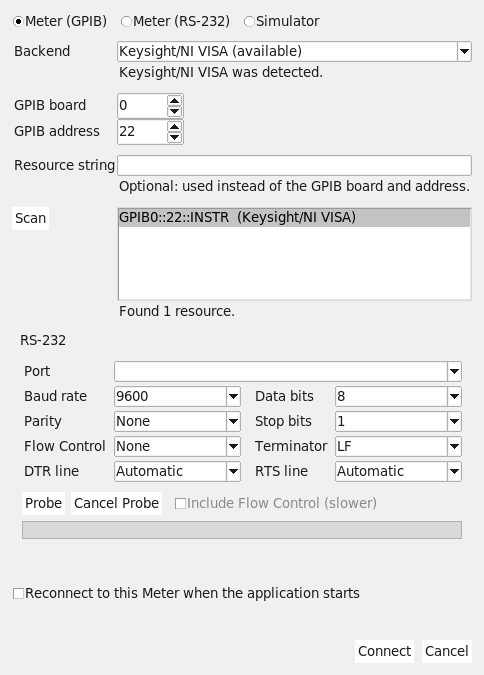

If the adapter is `GPIB1` in Connection Expert, set GPIB board to 1. From the command line the same is
`agilent34401a-cli read --backend ivi --gpib-board 1 --gpib-address 22`. If Keysight/NI VISA does not load, the
dialog gives the reason: usually the IO Libraries are not installed, or are of a different bitness from Python.

### Linux GPIB

pyvisa-py can drive a GPIB adapter through [linux-gpib](https://linux-gpib.sourceforge.io/), which comes from your
distribution or from its source and is not a pip package. The optional `gpib` extra adds the Python binding:

```bash
.venv/bin/pip install -e ".[gpib]"
agilent34401a-cli read --backend py --gpib-address 22
```

## First connection checklist

Before the first connection to a real Meter, in this order:

1. **Try the Simulator first**, `agilent34401a-gui --simulate`, to see what the window does with no hardware.
2. **Choose the interface at the Meter.** Open its front-panel menu and go to the I/O menu. For GPIB set the
   interface to GPIB and note the address (**22** is the factory setting); for RS-232 select **RS-232** as the
   interface and note its baud rate and parity. The language must be SCPI.
3. **Cable it.** GPIB: the adapter's GPIB cable. RS-232: a **null-modem (crossed)** cable, not a straight-through
   one. On Linux the serial port (`/dev/ttyUSB0` and the like) needs your user to be in the `dialout` group.
4. **Have nothing connected to the Meter's input terminals**, or a known harmless source, for the first Reading, and
   leave the Meter in whatever state it is in: connecting never changes its Setup.
5. **Connect.** File → Connect…, choose Meter (GPIB) or Meter (RS-232), then Connect. For RS-232 whose settings
   you do not know, use Probe (see [RS-232](#rs-232)). The status bar names the Connection and, once the Meter
   has answered `*IDN?`, its identity and firmware revision (`HEWLETT-PACKARD 34401A · firmware 10-5-2`). Both
   `HEWLETT-PACKARD` and `Agilent Technologies` firmware are accepted; anything that is not a 34401A is refused.
6. **Check the front panel.** The Meter's remote annunciator is lit (it is under the application's control), and the application's Function, Range,
   Resolution and Integration Time match what the display was showing before you connected: the application reads the
   Setup back without changing it ([ADR-0004](docs/adr/0004-read-back-setup-on-connect.md)).
7. **Compare a Reading.** With a real signal on the inputs, the window's readout and the front-panel display agree.
8. **Finish properly.** File → Disconnect, or closing the window, returns the Meter to **Local** and leaves its
   Setup as it was. The Meter is only reset by the System tab's Reset… button, after a confirmation, or by
   `agilent34401a-cli reset`. If the front panel's Local key does nothing, a Lockout is in force: untick "Lock out the
   front panel's Local key" on the System tab, or disconnect.

When the connection fails, the status bar says so and the window stays usable: fix the cause and use File → Connect…
again. GPIB: no response usually means a wrong address (check the Meter's I/O menu), the IO Libraries or the adapter
driver not installed, or another program holding the adapter. RS-232: see Probe's advice below.

## The window

Along the top is the readout: the Function, the Setup it is taken with (Range, Resolution or Integration Time, and
any Math Operation), and the latest Reading in VFD style with engineering prefixes. An overload is shown as `OVLD`.
Under it are a button for each of the 11 Functions, and a row with Run/Pause, Range (Auto or a fixed Range), Resolution,
Integration Time (0.02 to 100 NPLC), the **Raw Reading** switch (the Meter's own text), **Record** and **Single**.
Controls that do not apply to the Function are disabled. The status bar shows the Connection state and resource, the
Meter's identity, the Terminals (front or rear, which only the Meter's switch can change), any Meter error, `REC`
while recording, and the rate in Readings per second.

The menus are File (Connect…, Disconnect, Export chart as PNG… and SVG…, Record to CSV…, Export History as CSV…,
Export Burst as CSV…), View (Clear History, Compact mode, Theme) and Help (Shortcuts).

### Tabs

| Tab | What it does |
|---|---|
| **Chart** | A live plot of the History (the most recent 10 000 Readings unless you set another length) against time or sample number. Pan, zoom, Autoscale, Clear History, Break Markers where the Function or unit changed, and a strip of N, Mean, Std dev, Min, Max, Pk-Pk and the count of overloads, calculated from the History. Export to PNG or SVG from the File menu. |
| **Sense** | AC Filter (3, 20 or 200 Hz), Gate Time, Autozero (on, off or once) and Input Impedance, each enabled only for the Functions it applies to. |
| **Trigger** | Trigger Source, Trigger Delay, Sample Count and Trigger Count, and Start Burst. See [Single and Burst](#single-and-burst). |
| **Math** | Null, dB, dBm, the Meter's Statistics and a Limit Test. See [Math](#math). |
| **Presets** | Named Setups to save, apply, rename, delete, export and import. See [Presets](#presets). |
| **System** | Identity, firmware and SCPI version; Reset… (asks first) and Self-test; the front-panel Lockout; the beeper (with a test beep) and display (on or off, and a message of up to 12 characters); the calibration count and message, **read-only**; and the log of Meter errors with their time, code and message. |
| **SCPI console** | A raw SCPI command or query and the Meter's reply, with Up/Down to recall earlier commands. Calibration writes are refused unless the override is ticked, which covers the next command only ([ADR-0006](docs/adr/0006-calibration-writes-are-blocked.md)). |

The Chart is the image at the top: 150 Readings of the Simulator's wandering DC voltage. The other tabs:

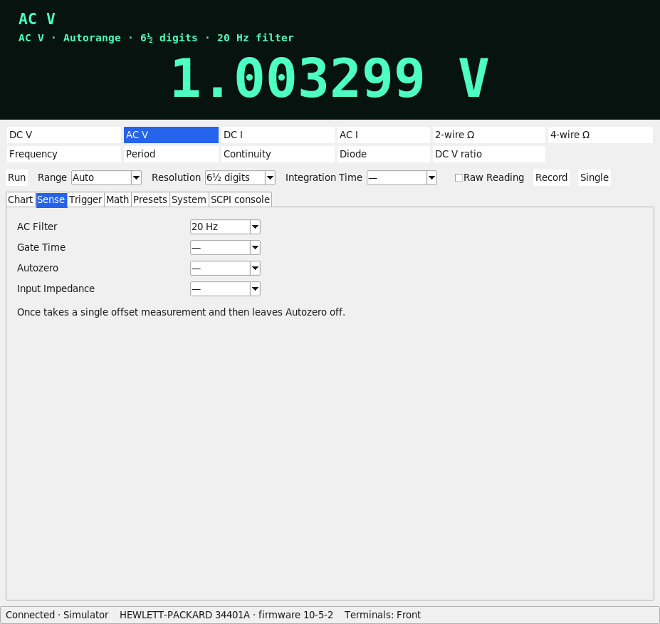

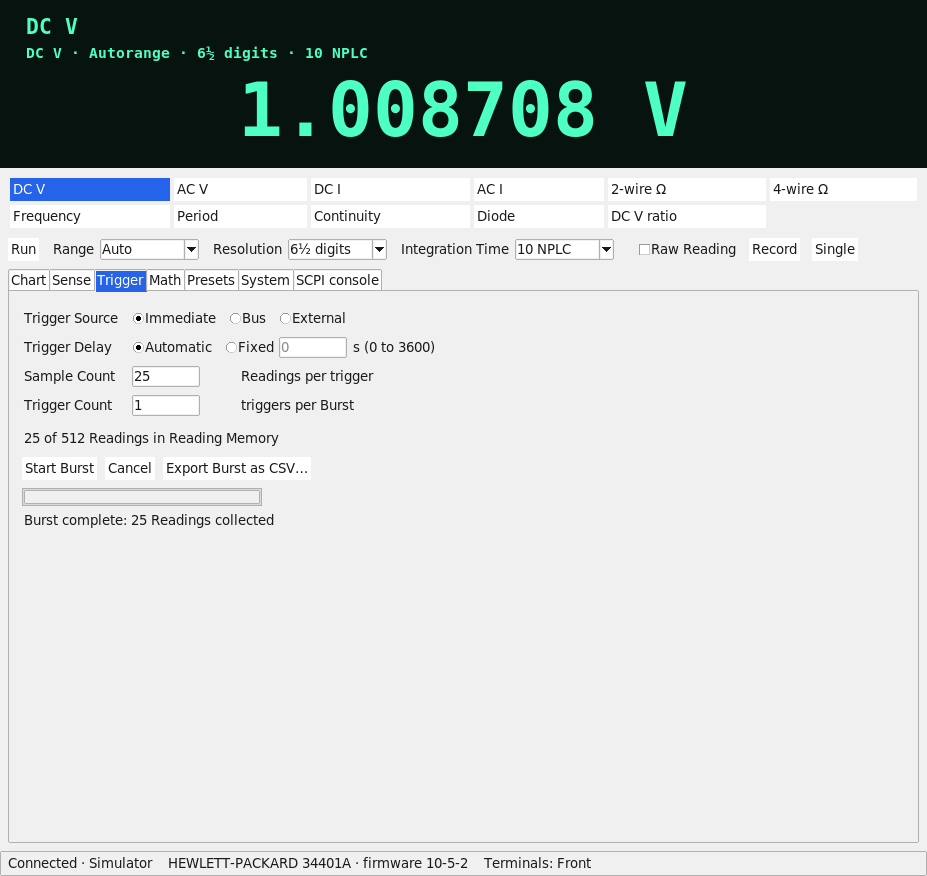

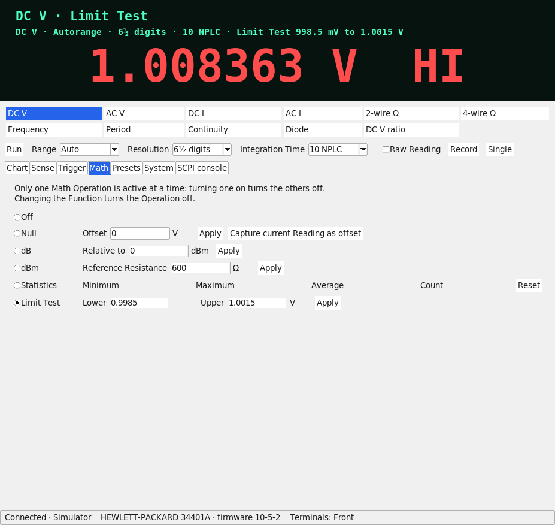

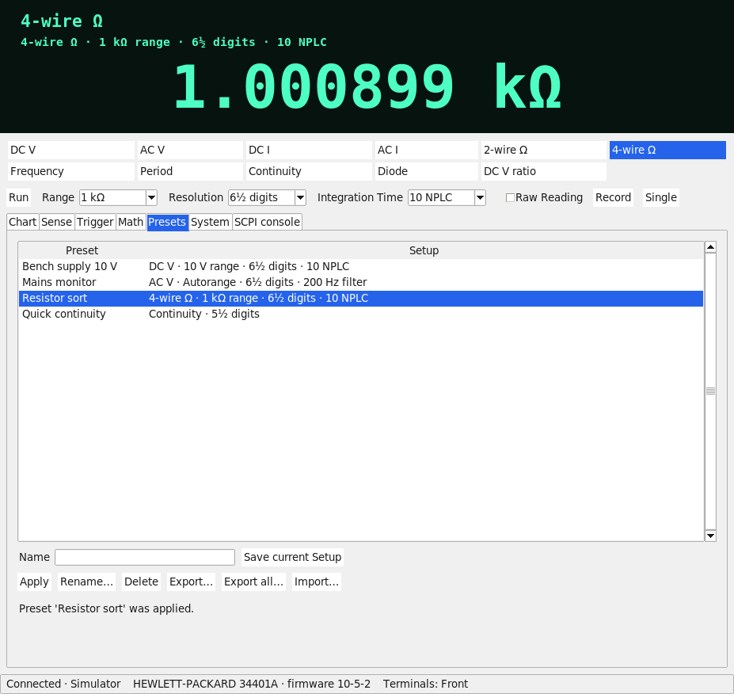

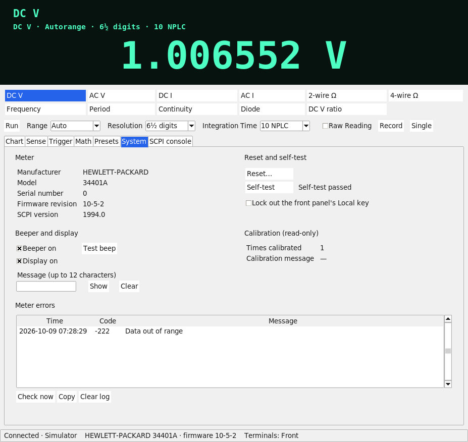

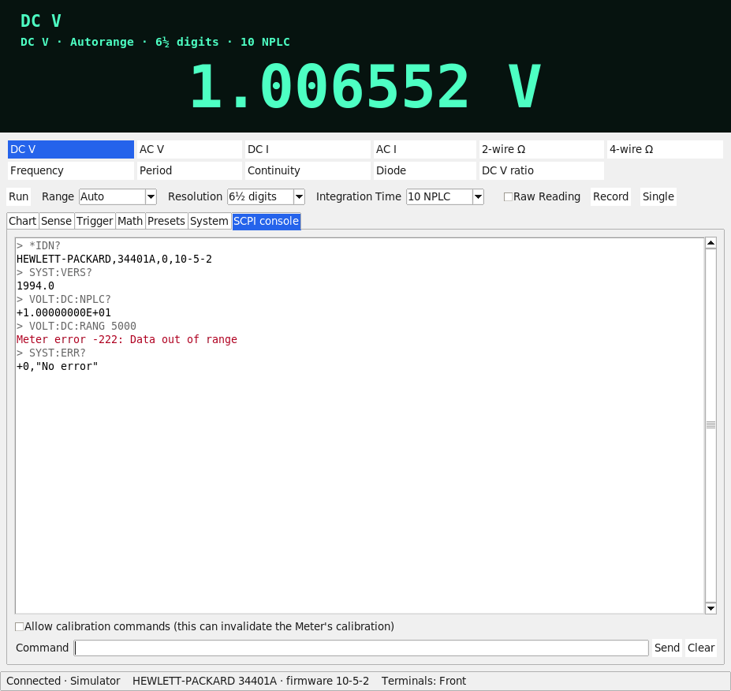

### Themes and compact mode

The **View** menu has:

- **Theme**: Light, Dark or System. Light and Dark are built on ttk's `clam` theme, which renders the same on
  Windows and Linux. System uses the platform's native ttk theme as it is. The choice is remembered.
- **Compact mode**: only the readout, the Function buttons, Run/Pause and the Range, Resolution and Integration Time
  controls are left (the setup line, Raw Reading and the tabs are hidden), and the window shrinks to fit. Also
  remembered.

| Light | Dark |
|---|---|
|  | 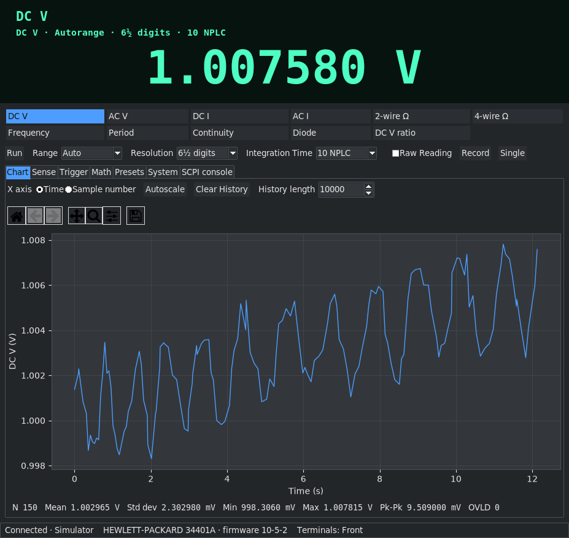 |

| System | Compact mode |
|---|---|
| 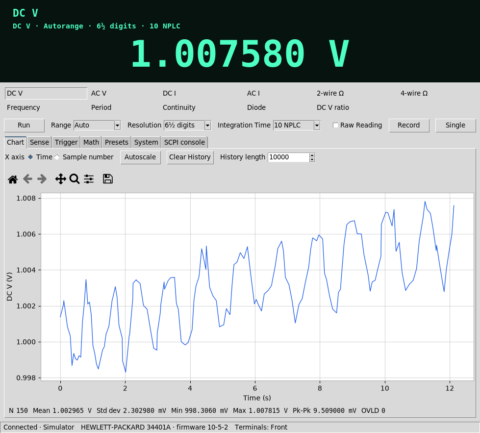 | 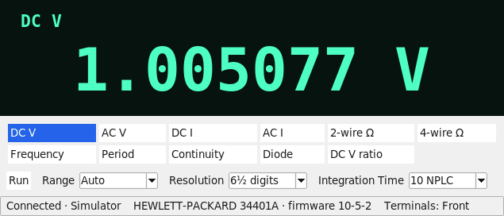 |

### Keyboard shortcuts

Help → Shortcuts lists them. Keys without Ctrl or Alt stay quiet while a text field has the keyboard focus.

| Shortcut | Action |
|---|---|
| F1 to F11 | Select a Function: DC V, AC V, DC I, AC I, 2-wire Ω, 4-wire Ω, Frequency, Period, Continuity, Diode, DC V ratio |
| R | Run or pause Continuous Readings |
| Space | Take a single Reading |
| Ctrl+L | Start or stop recording |
| Ctrl+K | Open the SCPI console |

Ctrl+, (Settings) appears in Help → Shortcuts as "planned, not available yet": there is no Settings window; see below.

### Settings and Presets files

Settings and Presets are kept in the platform's usual per-user config folder: `%APPDATA%\agilent34401a\` on
Windows, and `$XDG_CONFIG_HOME/agilent34401a/` (`~/.config/agilent34401a/` when that is not set) on Linux.

- `settings.json` holds the theme, Compact mode, the History length, the chart's x-axis, the last Connection, whether to
  reconnect to it at startup (the checkbox at the bottom of the connection dialog; off by default), and
  `error_check_interval_s`, how often (default 5 s, 1 to 3600) the status byte is checked for queued Meter errors
  while Readings are being taken. Everything but that last one is changed from the window. A file that cannot be read,
  or a value that is not valid, gives the default for that setting and never stops the application starting.
- `presets.json` holds the [Presets](#presets).

Both are written atomically. Delete them to start afresh.

## Command line

`agilent34401a-cli read` takes one Reading. By default it talks to GPIB board 0, address 22, through the
first VISA Backend that loads (Keysight/NI VISA if installed, otherwise pyvisa-py):

```bash
agilent34401a-cli read                                    # GPIB0::22::INSTR, Backend auto
agilent34401a-cli read --gpib-address 5 --backend py      # pyvisa-py only (needs linux-gpib or gpib-ctypes for GPIB)
agilent34401a-cli read --resource "TCPIP::192.0.2.1::5025::SOCKET"   # any raw VISA resource
agilent34401a-cli read --simulate                         # the built-in Simulator, no Meter needed
```

Options you leave out keep the Meter's current Setup. `--function` (`dcv`, `acv`, `dci`, `aci`, `res`, `fres`, `freq`,
`period`, `cont`, `diode` or `ratio`), `--range` (in volts, amps or ohms, or `auto`) and `--resolution` (4.5, 5.5 or
6.5 digits) change it first:

```bash
agilent34401a-cli read --simulate --function res --range auto --resolution 5.5     # 1.00000 kΩ
```

The Connection options are `--backend` (`auto`, `ivi` for Keysight/NI VISA or `py` for pyvisa-py), `--gpib-board`,
`--gpib-address`, `--resource`, `--simulate`, and the [RS-232 options](#rs-232). The same options work for the
administration commands. Each exits with 0 on success and 1 on failure:

```bash
agilent34401a-cli idn --simulate        # print the Meter's identity and firmware revision
agilent34401a-cli errors --simulate     # print and clear the Meter's error queue
agilent34401a-cli selftest --simulate   # run the self-test (about 10 s on a real Meter); 1 if it fails
agilent34401a-cli reset --simulate      # *RST: the only command that resets the Meter
```

`raw` sends one raw SCPI command or query and prints the reply, like the SCPI console tab (Ctrl+K). Commands that
would change the Meter's calibration (`CAL:SEC`, `CAL:VAL`, `CAL`, `CAL:STR` writes) are refused with exit code 2
unless you pass `--allow-calibration`; read-only queries such as `CAL:COUN?` need no flag:

```bash
agilent34401a-cli raw --simulate "*IDN?"
agilent34401a-cli raw --simulate "VOLT:DC:NPLC 10"        # a command: no reply, exit 1 if the Meter complains
```

`log` takes Readings with the Meter's current Setup and writes them as CSV to standard output, or to a file with
`-o`. Give `-n` (a number of Readings), `--duration` (seconds) or both; it stops at whichever comes first, and
keeps the rows already written if it is interrupted or fails. A Reading that is lost (a garbled or missing reply) is
a warning on standard error, not the end: the log resynchronises the Connection and carries on, a lost Reading is not
a row (so `-n 100` still ends with 100), and the exit code is 0 when the log completed. If 5 Readings in a row are lost,
or the Meter does not answer the resynchronisation, the Meter is taken to be gone and `log` stops with an error and
exit code 1:

```bash
agilent34401a-cli log --simulate -n 100 -o capture.csv
agilent34401a-cli log --simulate --duration 60 > capture.csv
```

`probe` finds the RS-232 settings of a Meter (see [RS-232](#rs-232)). A failure anywhere prints
`agilent34401a-cli: error: ...` on standard error, and a usage mistake exits with 2. `--help` on the command and on each
subcommand lists everything.

To exercise the real pyvisa stack without a Meter, run the [Simulator](#simulator) as a TCP server and point the CLI at it:

```bash
agilent34401a-sim --port 5025 &
agilent34401a-cli read --backend py --resource "TCPIP::127.0.0.1::5025::SOCKET"
```

### RS-232

Choose "Meter (RS-232)" in the connection dialog (File → Connect…), or give the CLI a `--serial-port`. Pyvisa-py
and pyserial are installed with the package, so no vendor software is needed. Every parameter is configurable;
the defaults are the Meter's factory settings:

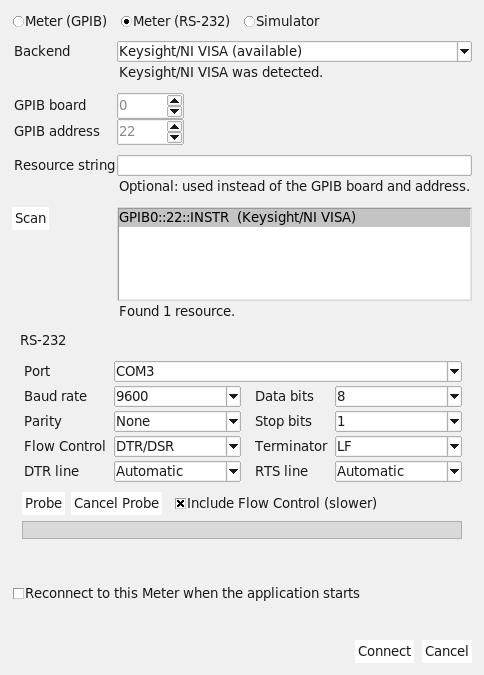

```bash
agilent34401a-cli read --serial-port COM3                 # 9600 baud, 8 data bits, no parity, 1 stop bit, no Flow Control
agilent34401a-cli read --serial-port /dev/ttyUSB0 --baud 4800 --data-bits 7 --parity even --flow-control dtrdsr
```

The options are `--baud` (300 to 9600), `--data-bits` (7 or 8), `--parity` (none, even, odd), `--stop-bits` (1 or 2),
`--flow-control` (none, xonxoff, rtscts, dtrdsr), `--terminator` (lf, cr, crlf), and `--dtr`/`--rts` (on or off)
to hold those lines for an unusual cable. The Meter is put in Remote with `SYST:REM` when the Connection opens and
returned to Local with `SYST:LOC` when it closes. Lockout over RS-232 is `SYST:RWL`; over GPIB it is the bus's own
Local Lockout message, which the application releases before it disconnects.

If you do not know the Meter's settings, use Probe: the Probe button in the dialog (with a progress bar and
Cancel), or the `probe` subcommand, which prints the options that work and exits with 0 when it found a Meter:

```bash
agilent34401a-cli probe --serial-port COM3
agilent34401a-cli probe --serial-port /dev/ttyUSB0 --include-flow-control --quiet
```

It tries every baud rate, 9600 first, with each of the
Meter's three Framings (8N1, 7E1, 7O1) until the Meter answers `*IDN?`; tick "Include Flow Control" (or pass
`--include-flow-control`) to try every Flow Control as well, which takes four times as long. Probe needs the port to
itself, so disconnect first. When nothing answers it says what to check:

- the cable must be a null-modem (crossed) cable, not a straight-through one;
- the Meter's I/O menu must be set to RS-232 rather than GPIB, and its baud rate and parity set under that menu;
- the Flow Control must match the Meter's handshake, which is why Probe can include it.

Linux caveat: pyserial does not implement DTR/DSR Flow Control in hardware on Linux; it only asserts DTR, and
never waits for DSR. Windows implements it. On Linux, DTR/DSR therefore behaves like no Flow Control with DTR held
asserted, so use a slower baud rate if characters are lost.

## Recording and CSV

The window records Readings to a file: the Record button (or File → Record to CSV…, or Ctrl+L) streams every Reading
to a file and the status bar shows `REC` and the file until you stop; File → Export History as CSV… saves the Readings
the Chart is showing. The columns are `timestamp_iso, elapsed_s, function, range, value, unit, raw, math_mode,
limit_result`. `value` is in the base unit (volts, ohms, ...); for an Overload it is the Meter's own number, `9.9e+37` or `-9.9e+37`
(the window shows OVLD, the CSV keeps the column numeric). `raw` is the Meter's own text. The file is UTF-8 with LF line
endings; Excel needs "From Text/CSV" with UTF-8 to show the Ω unit.
`math_mode` is the Math Operation in effect (`NULL`, `DB`, `DBM`, `STATS` or `LIMIT`; empty for none) and
`limit_result` is `HI`, `LO` or `PASS` during a Limit Test. Under Null `value` is the Reading minus the offset, and
under dB or dBm it is in dB or dBm, which `unit` says. The command line's `log` writes the same columns.

## Single and Burst

**Single** (the button next to Run, or the Space key) takes exactly one Reading and pauses Continuous. The
**Trigger** tab sets up a **Burst**: the Trigger Source (immediate, bus or external), the Trigger Delay (automatic, or
fixed from 0 to 3600 s), the Sample Count and the Trigger Count. Start Burst has the Meter take that many Readings into
its Reading Memory on its own and then collects them; they appear in the readout, the chart and the History, and
File → Export Burst as CSV… saves them (the Meter keeps no time stamps, so each Reading's time is worked out from the
Setup).

- Reading Memory holds 512 Readings, so a Burst of Sample Count x Trigger Count above 512 (or with an infinite
  Trigger Count) is refused before anything is sent.
- Bus triggers are sent by the application. An external trigger may never arrive, so the application polls the
  Meter's status byte instead of waiting, and Cancel sends a device clear.
- A Connection that cannot send a device clear (a raw TCP socket, such as the `agilent34401a-sim` server) cannot
  cancel a wait for an external trigger, so the External source is disabled there, with a tooltip saying why.
- The Meter's trigger settings are put back when the Burst ends, so Run and Single keep working.
- Run and Single need one immediately triggered Reading. If the Meter is left on a bus or external trigger, or on
  several Readings, they put it back to that (the Trigger Delay stays) and the Trigger tab shows the change.

## Math

The Math tab applies the Meter's Math Operations, one at a time: Null (with an offset you type or capture from the
current Reading), dB, dBm (Reference Resistance 50 Ω to 8 kΩ), the Meter's own Statistics (minimum, maximum, average and
count, with Reset) and a Limit Test. The readout names the Operation and turns red with HI or LO when a Reading fails
the Limit Test. The Meter turns the Operation off when the Function changes.

## Presets

The Meter's own memory (`*SAV` and `*RCL`) holds only a few unnamed Setups and can be used only through the remote interface, so the Presets tab keeps named Setups in the application. Save current
Setup stores what the Meter last reported under the name you type. Apply sends a Preset to the Meter (Function first,
then Range and Resolution, the sense options, the trigger and the Math Operation) and then says which settings the Meter
did **not** take, so that a Preset never half-applies without you knowing; the Meter's own error messages follow. Rename…,
Delete, Export… (one Preset), Export all… and Import… (a file, asking whether to replace or keep both when a name is
already used) complete the tab. Presets live in `presets.json` beside the settings and travel between bench PCs as
exported `.json` files. A Preset holds the Setup the Meter reported, so it never holds Autozero Once.

## Simulator

The Simulator is one model of the Meter, shipped inside the package ([ADR-0003](docs/adr/0003-simulator-ships-in-the-package.md)):
Functions, Ranges and Autorange, Overload, Resolution and Integration Time timing, Reading Memory, triggering, Math
Operations, Statistics and the Limit Test, and an error queue with the real error codes. It runs in two forms:

- **In process**, which is what `--simulate` uses in the window and the CLI, and what the tests use. The window's
  Simulator has an Applied Signal for most Functions (about 1 V DC with noise, a little drift and a slow sine; 1 kΩ; 1 kHz)
  so the Chart has something to draw; the CLI's reads a steady 1 V.
- **As a TCP server**, `agilent34401a-sim`, reached with the VISA resource `TCPIP::127.0.0.1::5025::SOCKET`
  through the real pyvisa stack:

```bash
agilent34401a-sim --port 5025 &
agilent34401a-gui --backend py --resource "TCPIP::127.0.0.1::5025::SOCKET"
```

Its options are `--host` (default 127.0.0.1), `--port` (default 5025; 0 picks any free one), `--identity` (`hp` or
`agilent`, which firmware to pretend to be), `--time-scale` (1 is real time, 0 is instant) and `--fault`. The
`AGILENT34401A_SIM_TIME_SCALE` environment variable sets the time scale of the in-process Simulator in the same way.

The server can also misbehave on purpose, to see how a client copes. `--fault EFFECT[:OPTION=VALUE,...]` may be repeated;
the effects are `slow`, `drop`, `reset`, `noise`, `truncated`, `unterminated` and `wrong-type`, and the options are
`delay` (seconds), `command` (a regular expression), `after`, `every`, `times` and `seed`:

```bash
agilent34401a-sim --port 5025 --fault slow:delay=3,command=READ --fault drop:after=50
```

## Development

`tkinter` is a system package, not a PyPI one. On Debian/Ubuntu: `sudo apt install python3-tk xvfb`
(`xvfb` gives GUI tests and screenshots a virtual display on a machine with none).

```bash
python3 -m venv .venv
.venv/bin/pip install -e ".[dev]"
.venv/bin/pre-commit install --install-hooks
```

The domain terms used in the code, the UI and the tests (Meter, Reading, Setup, Preset, Connection, Backend, ...) are
defined in [GLOSSARY.md](GLOSSARY.md), and the reasons for the larger decisions are the records in [docs/adr](docs/adr).

### Code quality

```bash
.venv/bin/black --check src tests scripts    # formatting
.venv/bin/ruff check src tests scripts       # linting (all rules enabled)
.venv/bin/mypy                               # strict type checking
.venv/bin/bandit -c pyproject.toml -r src    # security scan
.venv/bin/pip-audit .                        # runtime dependency vulnerabilities
.venv/bin/pytest                             # tests (use xvfb-run -a on a headless box)
.venv/bin/python scripts/ci_smoke_test.py    # builds the GUI against the Simulator and shuts it down (xvfb-run -a if headless)
.venv/bin/coverage report --omit="*/agilent34401a/gui/*" --fail-under=85   # coverage gate (GUI excluded)
```

All of it is configured in `pyproject.toml` and `.pre-commit-config.yaml`, and CI runs it on every push and pull request:
the static analysis, the tests on Linux for Python 3.10 to 3.14 (under Xvfb) and on Windows for 3.14, the GUI smoke test,
the coverage gate, and a build of the wheel and sdist.

The coverage gate covers everything except the `gui` package; GUI coverage is still shown in the
`pytest` report but isn't gated ([ADR-0007](docs/adr/0007-strict-static-analysis-and-scoped-coverage.md)).

### Screenshots

The images in `docs/images/` are taken against the Simulator by a script, so they can be retaken whenever the window
changes:

```bash
.venv/bin/python scripts/take_screenshots.py      # rewrites docs/images/*.png
```

It starts itself again under `xvfb-run` with a fixed 1440x1000 screen at 96 dpi (Linux, with `xvfb` and `python3-tk`
installed), runs the real window against the Simulator with fixed Applied Signals and a fixed seed, fills the Chart with
150 Readings, and saves each theme, Compact mode, every tab and the connection dialog as a small palette PNG. The
connection dialog's detection and Scan results are made up for the picture. The script is not part of CI; look at the
changed images before committing them.

### Releasing

Releases are cut by hand from the **Release** workflow (Actions, Release, Run workflow); nothing is released by a
push or a tag. To release:

1. Bump `version` in `pyproject.toml` (the only place the version lives) and merge it to `main`.
2. Run the Release workflow on `main`. It refuses to start if the tag `v<version>` already exists.
3. It runs the static analysis and tests (Linux and Windows), builds the wheel and sdist, runs `twine check` and
   `check-wheel-contents`, then installs the built wheel into a clean virtual environment on Windows with Python
   3.11, 3.12, 3.13 and 3.14. There it constructs the GUI against the Simulator and runs `--help` for
   `agilent34401a-cli` and `agilent34401a-sim`.
4. Only if every one of those passed does it create the release `v<version>`, with the wheel and sdist attached and
   generated release notes. Run from any other branch, it executes the gates as a dry run and creates nothing.

The tag name comes from `scripts/release_info.py` (`tag`, `version` and `check-dist` subcommands), so it can't
drift from `pyproject.toml`.

#### PyPI (prepared, not enabled)

`release.yml` contains a `publish-pypi` job using PyPI Trusted Publishing (OpenID Connect, no API token). It is
switched off with `if: false`, and it is the only job with `id-token: write`. To enable it, register
`vk5as/34401A-GUI`, workflow `release.yml`, environment `pypi` as a trusted publisher for `agilent34401a` on
pypi.org, create a `pypi` environment in the repository settings, and change `if: false`; the comments above the
job list the steps. Until then, [Installation](#installation) is from a checkout or a release's wheel.

### Freezing

The package is kept compatible with freezers such as PyInstaller: it never builds paths from `__file__`, and package
data (`py.typed`) is reached through `importlib.resources`. `tests/test_freeze_compatibility.py` guards this.

## AI assistance

This project was built with the assistance of AI. The code, the tests and this documentation were written largely by
[Claude Code](https://claude.com/claude-code), Anthropic's coding agent, working from specifications and tickets
(see the [spec](https://github.com/vk5as/34401A-GUI/issues/1)) that the author wrote. The author, VK5AS, decides what
is built, reviews what the agent produces, and is responsible for the result. The same applies to every screenshot
here: they are taken by a script from the real application running against the Simulator, not mocked up.

## License

MIT, see [LICENSE](LICENSE).
